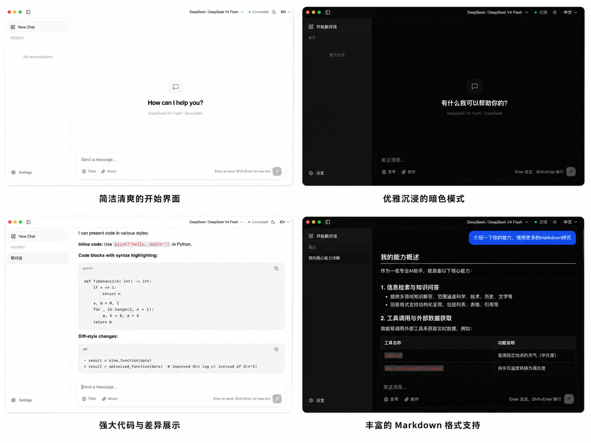

# tauri-ai-starter

[中文](README.md)

A development template for building AI desktop apps. Built on Tauri v2 + Vue 3 + NestJS, provides a fully functional AI Chat app with clean, extensible code.



## Highlights

- **Native desktop** — Tauri v2 (not Electron), low memory footprint, macOS custom titlebar with frosted glass
- **Works out of the box** — install dependencies and run, full AI Chat functionality included
- **Multi-model** — Strategy pattern for multi-provider model support, with thinking/deep reasoning mode
- **Cross-platform** — macOS / Windows / Linux build support
- **Sidecar architecture** — NestJS backend compiled to standalone binary, bundled in the app package
- **Clean code** — Modular design with Composable + DTO + Strategy patterns, easy to extend

## Tech Stack

| Layer | Technology |
|---|---|
| Desktop Framework | Tauri v2 (Rust) |
| Frontend | Vue 3 + Vite + Tailwind CSS v4 |
| Backend | NestJS 11 (Tauri Sidecar) |
| Database | SQLite (better-sqlite3 + Drizzle ORM) |
| AI | AI SDK (`@ai-sdk/openai-compatible`) |
| Build | pnpm monorepo |

## Features

- Multi-model AI chat (SSE streaming)
- Conversation management (create, rename, delete, auto-title generation)
- Markdown rendering (math formulas, code highlighting)
- Thinking/deep reasoning mode toggle
- Light/dark theme (follow system / manual toggle, Tauri native window sync)
- i18n internationalization (中文 / English, language switcher)
- Encrypted API key storage (AES-256-GCM)
- macOS custom titlebar with frosted glass effect

## Model Providers

| Provider | Models | Status |
|---|---|---|
| SiliconFlow | DeepSeek V4 Flash, DeepSeek R1 | Supported |
| DeepSeek | DeepSeek V4 Flash, DeepSeek V4 Pro | Supported |
| OpenAI | GPT-4o, o4-mini, etc. | Planned |
| Anthropic | Claude Opus 4.x, Claude Sonnet 4.x, etc. | Planned |
| Google | Gemini 2.5 series | Planned |
| Ollama | Local models | Planned |

PRs welcome for new provider contributions.

## Quick Start

```bash
# Install dependencies (requires pnpm >= 11.4)
pnpm install

# Launch desktop app (dev mode)
pnpm tauri:dev

# Or run individually
pnpm dev          # Start both frontend + backend
pnpm web:dev      # Frontend only (http://localhost:1420)
pnpm server:dev   # Backend only (http://localhost:3000)
```

Production build:

```bash
pnpm tauri build
```

## Project Structure

```
├── packages/
│   ├── desktop/         ← Tauri v2 + Vue 3 desktop app
│   │   ├── src/         # Vue components / state management / API layer
│   │   └── src-tauri/   # Rust layer (window management / sidecar spawn)
│   ├── server/          ← NestJS backend (compiled to sidecar binary)
│   │   └── src/modules/
│   │       ├── chat/    # AI chat + SSE streaming
│   │       ├── sessions/# Session CRUD
│   │       └── settings/# Provider API key management
│   └── shared/          ← Shared TypeScript types
```

## Roadmap

- [ ] Session search
- [ ] Custom system prompt
- [ ] Image / file upload
- [ ] More model provider support

## License

MIT
